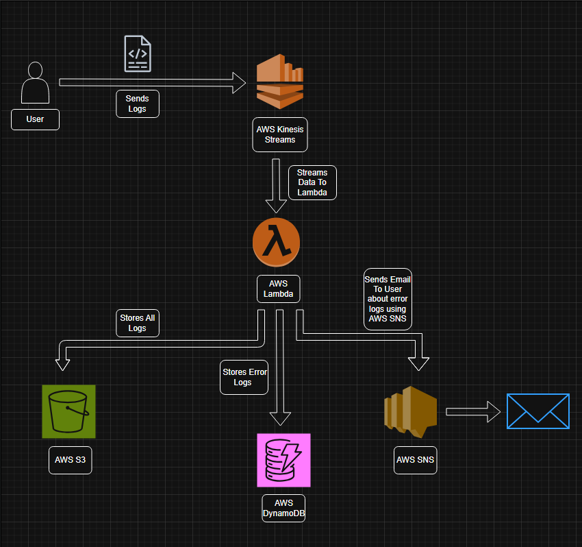

# Real-Time Log Processing & Alerting System (AWS Serverless)

---

##  Overview

This project implements a **real-time log processing pipeline** using AWS serverless services.

A Python producer continuously sends logs to **Amazon Kinesis**, which are processed by **AWS Lambda** to detect anomalies. Logs are stored in **Amazon S3 (partitioned)**, critical events are saved in **DynamoDB**, and alerts are triggered via **SNS**.

---

##  Architecture
<p align="center">
  
</p>

```
Producer → Kinesis → Lambda → (S3 + DynamoDB + SNS)

```

---

##  Project Structure

```
project-root/
│
├── producer.py        # Log generator (run locally)
├── log-processor.py   # Lambda function code
├── Architecture.png   # Architecture diagram
└── README.md
```

---

##  Prerequisites

* AWS Account
* AWS CLI configured
* Python 3 installed

Run:

```bash
aws configure
```

---

##  Setup Guide (Step-by-Step)

Follow these steps **in order**.

---

### 1. Create Kinesis Stream

* Go to AWS → Kinesis → Data Streams
* Create stream:

  * Name: `log-stream`
  * Mode: On-demand

---

### 2️. Create S3 Bucket

* Go to S3 → Create bucket
* Name: `logs-bucket-<unique-name>`

---

### 3️. Create DynamoDB Table

* Table name: `log-alerts`
* Partition key: `log_id` (String)

---

### 4️. Create SNS Topic

* Create topic: `log-alert-topic`
* Add email subscription
* Confirm via email

---

### 5️. Create IAM Role (IMPORTANT)

Attach these permissions:

* AmazonKinesisFullAccess
* AmazonS3FullAccess
* AmazonDynamoDBFullAccess
* AmazonSNSFullAccess
* CloudWatchLogsFullAccess

---

### 6️. Deploy Lambda Function

* Go to AWS Lambda → Create function
* Runtime: Python 3.10+
* Attach IAM role

---

###  Upload Lambda Code

Open file:

```
log-processor.py
```

Copy **entire code** and paste into:

```
Lambda → Code Editor → lambda_function.py
```

---

###  Set Environment Variables

In Lambda → Configuration:

```
TABLE_NAME = log-alerts
BUCKET_NAME = your-bucket-name
SNS_TOPIC_ARN = your-topic-arn
```

---

###  Add Trigger

* Add trigger → Kinesis
* Select: `log-stream`
* Starting position: Latest

---

### 7️. Run Producer Script

Open terminal:

```bash
python producer.py
```

---

##  Testing the System

After running the producer:

###  Check:

* Kinesis → Incoming records increasing
* Lambda → Executions happening
* S3 → Logs stored in partitioned format
* DynamoDB → Only error/high latency logs
* SNS → Email alerts received

---

##  Output Structure (S3)

Logs are stored like:

```
year=2026/month=03/day=18/hour=05/log-xxxx.json
```

---

##  Key Features

* Real-time log ingestion
* Event-driven processing
* Anomaly detection (ERROR / latency)
* Partitioned storage for scalability
* Automated alerting system

---

##  How to Stop Producer

Press:

```
CTRL + C
```

---


##  Summary

This project demonstrates how to build a **production-style, real-time data pipeline** using AWS serverless services with proper architecture, scalability, and alerting mechanisms.
